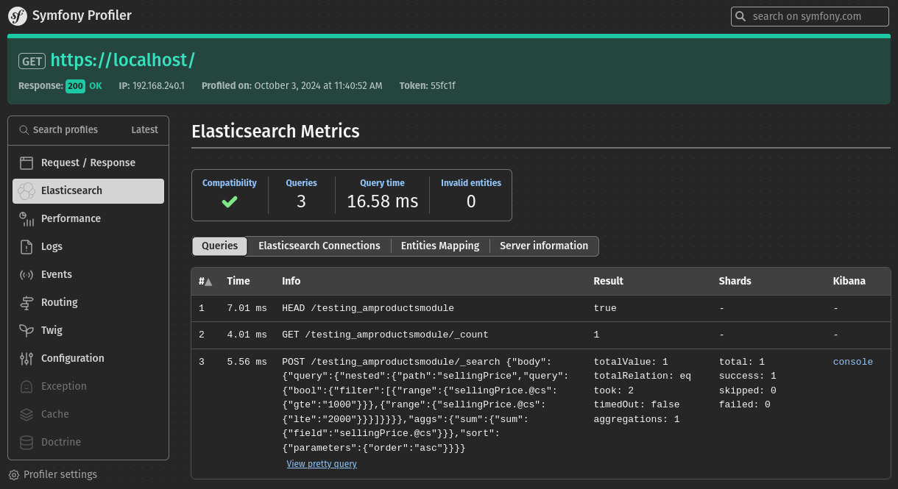

# Elasticsearch Bundle
Elasticsearch Symfony Bundle pro balíček https://github.com/ebrana/elasticsearch.

### Instalace
````
composer require ebrana/elasticsearch-bundle
````

#### Konfigurace

````yaml
elasticsearch:
    profiling: true
    indexPrefix: "katalog_"
    # cache je nepovinné (adapters: https://symfony.com/doc/current/components/cache.html#available-cache-adapters)
    cache: 'cache.adapter.filesystem'
    # tato sekce může být vynechána, protože attributes je default driver
    #    driver:
    #        type: "attributes" # attributes nebo json
    #        keyResolver: Elasticsearch\Bundle\KeyResolver # resolvuje klíče typu nested nebo object
    mappings:
        - App\Entity\Elasticsearch\Product
    connection:
        hosts:
            - '%env(resolve:ELASTICSEARCH_URL)%'
        username: ""
        password: ""
        cloudId: ""
        retries: 10
        elasticMetaHeader: true/false
        logger: "@logger" #Psr\Log\LoggerInterface
        httpClient: ... #Psr\Http\Client\ClientInterface
        asyncHttpClient: ... #Http\Client\HttpAsyncClient
        nodePool: ... #Elastic\Transport\NodePool\NodePoolInterface
        httpClientOptions: ... # podle http clienta
        api:
            apiKey: ""
            id: ""
        ssl:
            sslVerification: true/false
            sslCA: ""
            sslCert:
                cert: ""
                password: ""
            sslKey:
                key: ""
                password: ""
        
````

#### Registrace Document Builder Factories
Pro registraci použijte PHP atribut nad třídu builder factory

````php
#[AutoconfigureTag('elasticsearch.document_builder_factory')]
class ProductDocumentBuilderFactory implements DocumentBuilderFactoryInterface
{
   ...
}
````

#### Custom Key Resolver
ObjectType a NestedType disponuje možností resolvovat názvy fieldů. Pro Annotation driver
je možné si nastavit globálně resolver přes keyResolver atribut (viz. yaml výše).
Pokud z nějakého důvodu je potřeba u property vlastní resolver, tak je to možné udělat takto:


Vytvoříme si Custom resolver jako službu DI kontejneru a označíme tagem:
````php
#[AutoconfigureTag('elasticsearch.key_resolver')]
class CustomKeyResolver implements KeyResolverInterface
{
   ...
}
````
a upravíme PHP atribut následovně:
````php
#[NestedType(
   keyResolver: CustomKeyResolver::class,
   fieldsTemplate: new TextType(),
)]
protected array $sellingPrice = [];
````

#### Profiler

